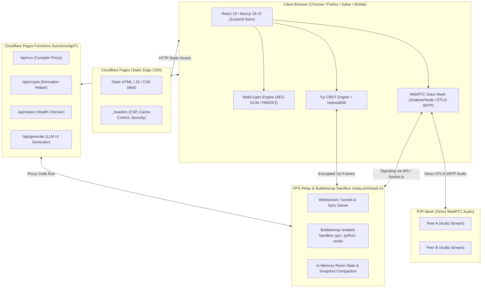
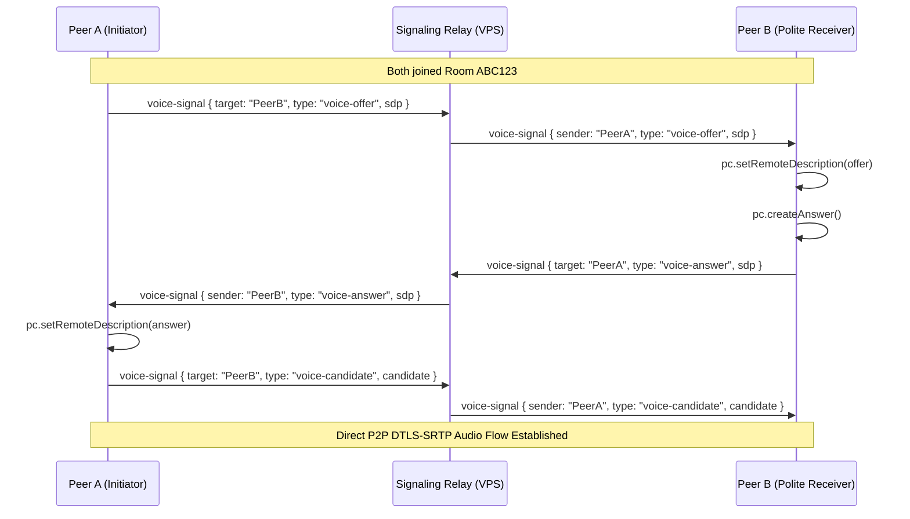
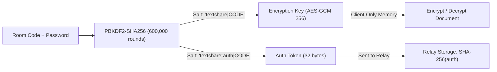

# anonshare — Technical Architecture Document

> **Version:** 5.3.0  
> **Target Environment:** Next.js 16 (Static Export) · Cloudflare Pages · Cloudflare Functions · Cloudflare Worker Durable Objects · Oracle VPS Relay  
> **Production Endpoint:** [https://code.avishkark.in](https://code.avishkark.in)  
> **Relay Server:** [https://relay.avishkark.in](https://relay.avishkark.in)  

---

## 1. High-Level System Architecture



---

## 2. Layer-by-Layer Specifications

### 2.1 Frontend & Application Layer
- **Framework**: Next.js 16.3.5 with App Router (`src/app/`)
- **Compilation**: Static Export (`output: "export"`, `distDir: "dist"` in `next.config.ts`)
- **Rendering Engine**: React 19 Client Components (`"use client"`)
- **State Management**: Zustand 5 with local storage persistence (`src/lib/store.ts`)
- **UI & Styling**: Tailwind CSS 4 with CSS variables, Lucide React icons, Radix UI primitives, Framer Motion animations
- **Local Persistence**: IndexedDB via `idb` / `y-indexeddb` for document CRDT states, `localStorage` for user preferences and bookmarks

---

### 2.2 Cloudflare Pages Edge Layer
- **Static Export Directory**: `dist/`
- **Configuration & Headers**: `public/_headers` (copied to `dist/_headers` during build)
- **Critical CSP Configuration**:
  ```http
  Content-Security-Policy: default-src 'self'; script-src 'self' 'unsafe-inline' https://static.cloudflareinsights.com; style-src 'self' 'unsafe-inline'; img-src 'self' data: blob: https:; font-src 'self' data:; connect-src 'self' https: wss:; frame-src 'self' https: blob: data:; worker-src 'self' blob:; manifest-src 'self'; object-src 'none'; base-uri 'self'; form-action 'none'; frame-ancestors 'none'
  ```
  > [!IMPORTANT]
  > Next.js static export outputs inline `<script>` tags for React hydration (`self.__next_f.push(...)`). `script-src` **MUST** include `'unsafe-inline'`; removing it will silently block React hydration and render all buttons dead!

---

### 2.3 Cloudflare Pages Functions Layer (`functions/api/`)
Since `output: "export"` disables Node.js server routes in Next.js App Router, dynamic serverless functions run directly as Cloudflare Pages Functions:
1. `functions/api/run.ts`:
   - Validates language, code length, and stdin.
   - Forwards execution payload to Oracle VPS sandbox at `https://relay.avishkark.in/run`.
2. `functions/api/crypto.ts`:
   - Server-side derivation benchmark and verification helper.
3. `functions/api/status.ts`:
   - Returns real-time health metrics, memory usage, and socket status.
4. `functions/api/generate.ts`:
   - Provides safe fallback generative HTML code generation.

---

### 2.4 Real-Time WebRTC Voice Mesh Engine (`src/lib/voice.ts`)



- **Polite Peer Negotiation**: Resolves glare collisions deterministically by comparing client IDs (`myCid.localeCompare(peerCid) < 0`).
- **Web Audio Analyzer**: `AudioContext` + `AnalyserNode` (256 FFT size) runs every 100ms:
  - Local Audio: Calculates RMS volume ($0\dots 100\%$) and broadcasts `voice-state { speaking: true/false }`.
  - Remote Audio: Monitors incoming MediaStream volume without server relay.
- **Asymmetric Listener Support**: If microphone access is denied or hardware is unavailable, peers create an audio transceiver in `recvonly` mode to listen without throwing exceptions.

---

### 2.5 Zero-Knowledge Cryptographic Model



- **Dual-Salt Derivation**:
  1. $\text{Key} = \text{PBKDF2}(\text{Code} + \text{Password}, \text{salt}=\text{"textshare|"}+\text{Code}, 600000)$
  2. $\text{Auth} = \text{PBKDF2}(\text{Code} + \text{Password}, \text{salt}=\text{"textshare-auth|"}+\text{Code}, 600000)$
- **Relay Isolation**: The relay never receives $\text{Key}$. It only receives $\text{Auth}$, hashes it with SHA-256, and stores the hash. Even full compromise of the relay reveals zero document contents.

---

## 3. Project Directory Structure

```
c:\Users\Dell\Desktop\textshare\
├── functions/api/            # Cloudflare Pages Functions (Dynamic APIs)
│   ├── crypto.ts             # Cryptographic derivation helper
│   ├── generate.ts           # LLM UI Generator proxy
│   ├── run.ts                # Code execution proxy to VPS sandbox
│   └── status.ts             # Health check & system diagnostics
├── mini-services/
│   └── anonshare-sync/       # Standalone Socket.io sync server (port 3003)
│       └── index.ts          # Presence, cursor, edit, chat & voice-signal relay
├── public/                   # Static assets copied to dist/ during build
│   ├── _headers              # Production CSP, caching & security headers
│   ├── boot.js               # Legacy fast boot script
│   ├── favicon.png           # 40KB application icon
│   ├── icon-180.png          # iOS touch icon
│   ├── og.png                # OpenGraph social preview banner
│   ├── manifest.webmanifest  # PWA web manifest
│   ├── robots.txt            # Search crawler directives
│   └── sw.js                 # Network-first Service Worker
├── relay/                    # VPS Bubblewrap Sandbox & Relay Server
│   └── server.js             # High-performance WebSocket server
├── src/
│   ├── app/                  # Next.js App Router (layout, page, globals.css)
│   ├── components/
│   │   ├── editor/           # EditorStage, TabBar, TopBar, StatusBar, ChatSidebar
│   │   ├── landing/          # Hero, Features, HowItWorks, FAQ, LandingFooter
│   │   ├── palette/          # Modals & Drawers (VoicePanel, HistoryDrawer, FaqModal, etc.)
│   │   └── ui/               # Radix / Tailwind UI primitives
│   └── lib/
│       ├── store.ts          # Zustand master state store & actions
│       ├── use-sync.ts       # Socket.io sync & voice lifecycle hook
│       ├── voice.ts          # WebRTC VoiceMesh engine
│       ├── themes.ts         # Theme definitions & syntax tokens
│       └── detect.ts         # Language auto-detection engine
├── tests/                    # Vitest unit & integration test suite (56 tests)
├── worker/                   # Cloudflare Worker relay (Durable Objects)
├── next.config.ts            # Next.js static export configuration
├── tsconfig.json             # Strict TypeScript compiler options
├── package.json              # Dependencies & npm scripts
├── PRD.md                    # Product Requirements Document
├── Architecture.md           # Technical Architecture Document (this file)
├── rules.md                  # Development & Agent Invariants
├── design.md                 # UI / Design System Specifications
├── tasks.md                  # Task Tracking & Completed Milestones
└── memory.md                 # Project Memory & Incident Learnings
```
