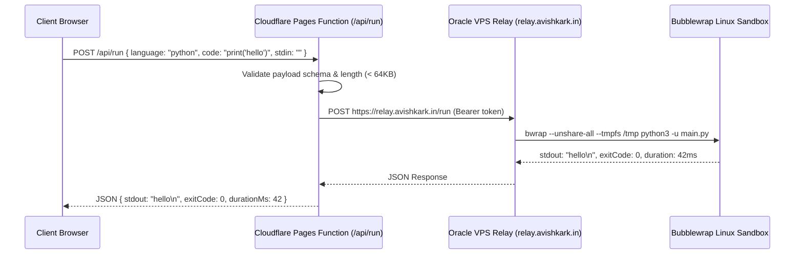
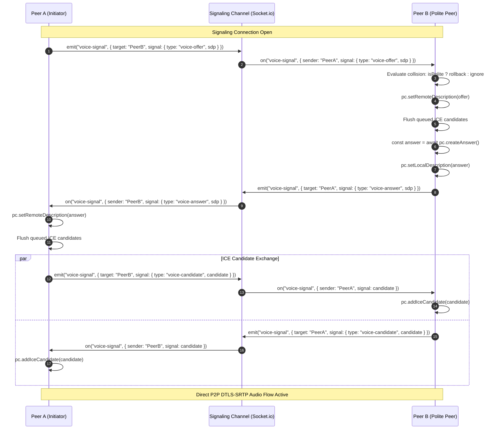
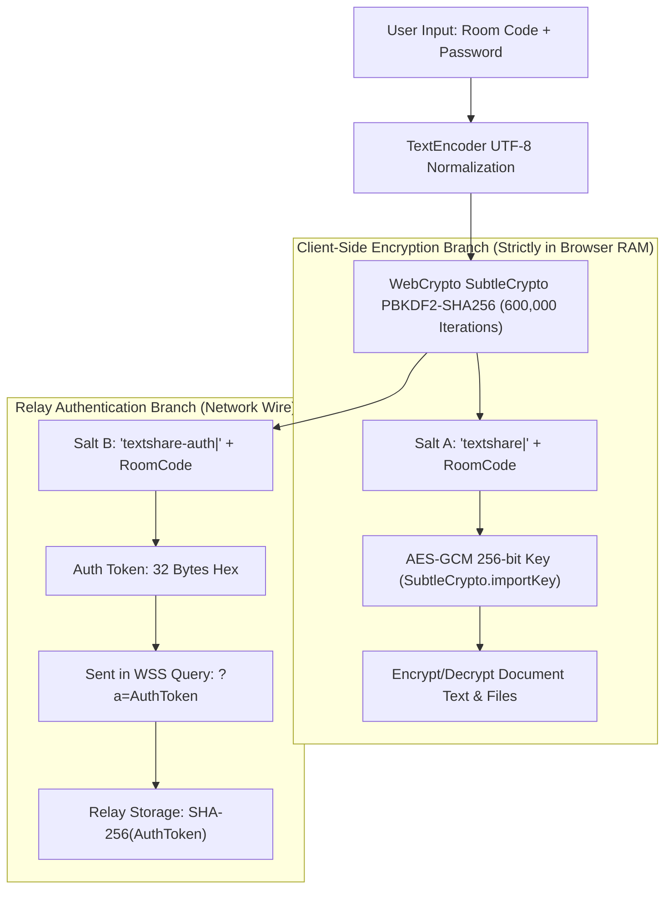

# anonshare — Comprehensive Technical Architecture Document

> **Architecture Standard:** Production Engineering Specification  
> **Version:** 5.3.0 (Master Blueprint)  
> **Target Platforms:** Next.js 16 (Static Export) · Cloudflare Pages · Cloudflare Functions · Oracle VPS Relay · WebRTC Mesh  
> **Primary URL:** [https://code.avishkark.in](https://code.avishkark.in)  
> **Relay Server:** [https://relay.avishkark.in](https://relay.avishkark.in) (WebSocket / HTTPS)  

---

## 1. High-Level Architectural Topology

```mermaid
flowchart TB
    subgraph ClientLayer ["Client Browser Layer (Desktop & Mobile)"]
        UI["React 19 / Next.js 16 UI (Zustand 5 Store)"]
        WebCrypto["Browser WebCrypto Subsystem (SubtleCrypto)"]
        YjsCRDT["Yjs CRDT Document Engine"]
        WebRTC["WebRTC Voice Mesh (DTLS-SRTP + Web Audio)"]
        IDB["IndexedDB Offline Persistence (idb)"]
        LocalStore["LocalStorage (Bookmarks, Preferences)"]
    end

    subgraph EdgeCDN ["Cloudflare Pages Edge Network (code.avishkark.in)"]
        DistStatic["Static Export Assets (dist/)"]
        CSPHeaders["_headers Engine (Strict CSP + Caching Rules)"]
    end

    subgraph EdgeFunctions ["Cloudflare Pages Functions (functions/api/*)"]
        RunAPI["/api/run (Code Execution Gateway)"]
        CryptoAPI["/api/crypto (Derivation Helper)"]
        StatusAPI["/api/status (Health Diagnostics)"]
        GenAPI["/api/generate (Template Fallbacks)"]
    end

    subgraph RelayVPS ["Oracle VPS Dedicated Relay (relay.avishkark.in)"]
        WSRelay["WebSocket Server (Node.js / ws)"]
        SyncRelay["Socket.io Mini-Service (:3003)"]
        BwrapSandbox["Bubblewrap Linux Sandbox (gcc, python, node)"]
        Compactor["In-Memory Snapshot Compaction Engine"]
    end

    subgraph P2PMesh ["Decentralized Peer-to-Peer Audio Mesh"]
        PeerA["Peer Client A"]
        PeerB["Peer Client B"]
        PeerC["Peer Client C"]
    end

    UI --> WebCrypto
    UI --> YjsCRDT
    UI --> WebRTC
    YjsCRDT <--> IDB
    UI <--> LocalStore

    ClientLayer <-->|HTTP/3 Fetch (Static HTML, Chunks)| EdgeCDN
    ClientLayer <-->|JSON POST Requests| EdgeFunctions
    EdgeFunctions <-->|Proxy Compiler Runs| BwrapSandbox

    YjsCRDT <-->|Encrypted Binary Frames (WSS)| WSRelay
    UI <-->|Presence, Chat, Cursor Events| SyncRelay
    WebRTC <-->|SDP Offer/Answer & ICE Signaling| SyncRelay
    WSRelay <--> Compactor

    WebRTC <===>|Direct DTLS-SRTP P2P Audio| PeerA
    WebRTC <===>|Direct DTLS-SRTP P2P Audio| PeerB
    WebRTC <===>|Direct DTLS-SRTP P2P Audio| PeerC
```

---

## 2. Detailed Subsystem Specifications

### 2.1 Frontend Client Architecture
- **Framework Core**: Next.js 16.3.5 utilizing React 19 Client Components (`"use client"`).
- **Compilation Target**: Static Export (`output: "export"`, `distDir: "dist"` in `next.config.ts`).
- **State Store ([`store.ts`](file:///c:/Users/Dell/Desktop/textshare/src/lib/store.ts))**:
  - Centralized reactive state managed via Zustand 5 with immutable state updates.
  - Slice architecture covering: Editor Tabs, Participants, Room Lifecycle, Terminal Lines, Chat Messages, WebRTC Voice State, Notifications, Bookmarks, and UI Overlays.
- **Offline & Storage Strategy**:
  - `idb` / `y-indexeddb`: Persists local document CRDT state across network re-connections.
  - `localStorage`: Retains visited room bookmarks (`anonshare.bookmarks`), persistent identity color (`anonshare.color`), theme choice (`anonshare.theme`), and dismiss flags.

---

### 2.2 Cloudflare Pages Edge & Content Security Policy (CSP)

```
+---------------------------------------------------------------------------------------------+
|                           HTTP Security Headers Specification                               |
+------------------------------------+--------------------------------------------------------+
| Directive                          | Value & Operational Rationale                          |
+------------------------------------+--------------------------------------------------------+
| default-src                        | 'self' — Restricts default resource loading to origin  |
| script-src                         | 'self' 'unsafe-inline' https://static.cloudflareinsights.com |
|                                    | (MANDATORY: 'unsafe-inline' enables React hydration)   |
| style-src                          | 'self' 'unsafe-inline' — Supports Tailwind inline vars |
| img-src                            | 'self' data: blob: https: — Supports file previews     |
| font-src                           | 'self' data: — Supports Geist / JetBrains Mono fonts   |
| connect-src                        | 'self' https: wss: — Allows WSS relay connections      |
| frame-src                          | 'self' https: blob: data: — Sandboxed preview iframes  |
| worker-src                         | 'self' blob: — Allows Web Workers and Service Workers  |
| object-src                         | 'none' — Blocks legacy Flash/ActiveX plugins           |
| base-uri                           | 'self' — Prevents base tag hijacking                   |
| form-action                        | 'none' — Disallows raw HTML form submissions           |
| frame-ancestors                    | 'none' (DENY) — Full clickjacking protection           |
| X-Content-Type-Options             | nosniff — Prevents MIME-type sniffing                  |
| Referrer-Policy                    | no-referrer — Zero referrer leaks to third parties     |
| Strict-Transport-Security          | max-age=31536000; includeSubDomains (Enforces HTTPS)   |
+------------------------------------+--------------------------------------------------------+
```

---

### 2.3 Cloudflare Pages Functions Layer (`functions/api/`)

Because `output: "export"` eliminates Node.js runtime servers in Next.js, all dynamic serverless capabilities are deployed as Cloudflare Pages Functions:



---

### 2.4 Binary Relay Protocol & Frame Specifications ([`relay/server.js`](file:///c:/Users/Dell/Desktop/textshare/relay/server.js))

The relay server communicates with clients over binary WebSocket connections utilizing 1-byte opcode headers followed by payload bytes:

```
+---------------+-----------------------------------------------------------------+
| Byte Offset   | Field Name & Description                                        |
+---------------+-----------------------------------------------------------------+
| Byte 0        | Opcode (Type Indicator: 0x00 to 0x09)                           |
| Bytes 1..N    | Variable-length Payload (Encrypted Ciphertext, JSON, or Binary) |
+---------------+-----------------------------------------------------------------+
```

#### Protocol Opcode Matrix:
| Opcode | Hex | Identifier | Persistence | Broadcast Behavior |
|---|---|---|---|---|
| `0` | `0x00` | `T_UPDATE` | Appended to Room Log | Forwarded to all other room peers |
| `1` | `0x01` | `T_AWARE` | Transient (Never stored) | Ephemeral broadcast for cursor/presence |
| `2` | `0x02` | `T_SNAPSHOT`| Replaces Room Log | Sent on snapshot compaction |
| `3` | `0x03` | `T_SYNCED` | None | Signals client that backlog sync is complete |
| `4` | `0x04` | `T_ERROR` | None | Emits error code string to client |
| `5` | `0x05` | `T_COMPACT`| Triggers compaction | Requests server to compact log |
| `6` | `0x06` | `T_STATE` | Persisted in memory | Room metadata state (read-only, TTL) |
| `7` | `0x07` | `T_KILLED` | Purges room memory | Closes all connected WebSockets |
| `8` | `0x08` | `T_GRANT` | None | Owner grants edit rights to peer |
| `9` | `0x09` | `T_P2P` | Transient | WebRTC signaling frame routing |

---

### 2.5 Real-Time WebRTC Voice Mesh Protocol ([`voice.ts`](file:///c:/Users/Dell/Desktop/textshare/src/lib/voice.ts))



#### Audio Frequency & Volume Loop Math
Every $100\text{ms}$, `VoiceMesh.monitorAudioActivity()` analyzes the active microphone stream:
1. `analyser.getByteFrequencyData(buffer)` fills a $128$-element frequency bin ($FFT=256$).
2. Average volume power is calculated:
   $$\bar{A} = \frac{1}{N} \sum_{i=0}^{N-1} \text{buffer}[i]$$
3. Normalized volume level ($0\dots 100\%$):
   $$L = \min\left(100, \text{round}\left(\frac{\bar{A}}{128} \times 100\right)\right)$$
4. Voice Activity Detection: If $\bar{A} > 20$, `setSpeaking(true)` triggers green avatar pulse rings.

---

### 2.6 Zero-Knowledge Cryptographic Derivation Engine



- **Salt Separation Guarantee**: Because $\text{Salt}_{\text{enc}} \neq \text{Salt}_{\text{auth}}$, observing the authentication token $T_{\text{auth}}$ on the network or compromising the relay database provides **zero mathematical leverage** to derive $K_{\text{enc}}$ or decrypt the document.

---

## 3. Directory & File Organization Reference

```
c:\Users\Dell\Desktop\textshare\
├── functions/api/            # Cloudflare Pages Functions (Serverless APIs)
│   ├── crypto.ts             # Cryptographic derivation benchmarking
│   ├── generate.ts           # Fallback LLM UI generator
│   ├── run.ts                # Code execution proxy to VPS sandbox
│   └── status.ts             # Live health and latency diagnostic endpoint
├── mini-services/
│   └── anonshare-sync/       # Standalone Socket.io Sync Server (Port 3003)
│       └── index.ts          # Presence, cursor, edit, chat, voice signaling relay
├── public/                   # Static assets directly served from root
│   ├── _headers              # Production CSP, security, and cache directives
│   ├── boot.js               # Fast boot script for legacy browsers
│   ├── favicon.png           # 40 KB application icon
│   ├── favicon.svg           # Scalable vector icon
│   ├── icon-180.png          # iOS touch icon
│   ├── logo.svg              # Primary brand logo
│   ├── manifest.webmanifest  # PWA manifest definition
│   ├── og.png                # Social OpenGraph card banner
│   ├── robots.txt            # Search crawler directives
│   ├── sitemap.xml           # Sitemap index
│   └── sw.js                 # Network-first Service Worker
├── relay/                    # Dedicated VPS Relay & Sandbox Engine
│   └── server.js             # High-performance WebSocket binary server
├── src/                      # Next.js Application Source
│   ├── app/                  # App Router Layouts & Pages
│   │   ├── globals.css       # Tailwind CSS 4 theme rules & keyframes
│   │   ├── layout.tsx        # HTML Root layout & font definitions
│   │   └── page.tsx          # Main entry page & global shortcut listeners
│   ├── components/
│   │   ├── editor/           # EditorStage, TabBar, TopBar, StatusBar, ChatSidebar
│   │   ├── landing/          # Hero, Features, HowItWorks, FAQ, LandingFooter
│   │   ├── palette/          # Modals & Drawers (VoicePanel, HistoryDrawer, FaqModal, etc.)
│   │   └── ui/               # Radix UI / Sonner Toast primitives
│   └── lib/
│       ├── db.ts             # Local database interfaces
│       ├── detect.ts         # Language auto-detection regex engine
│       ├── highlight.ts      # Syntax highlighting tokenizer
│       ├── store.ts          # Zustand master state machine & actions
│       ├── themes.ts         # Theme definitions & syntax tokens
│       ├── use-sync.ts       # Socket.io sync & voice lifecycle hook
│       ├── utils.ts          # Classname merger helpers
│       └── voice.ts          # WebRTC VoiceMesh engine
├── tests/                    # Vitest Unit & Integration Test Suites (56 Tests)
├── worker/                   # Cloudflare Worker Relay Source (Durable Objects)
├── next.config.ts            # Next.js static export build configuration
├── tsconfig.json             # Strict TypeScript compiler options
├── package.json              # Dependencies, scripts, and engine versions
├── PRD.md                    # Exhaustive Product Requirements Document
├── Architecture.md           # This Technical Architecture Document
├── rules.md                  # Inviolable Agent & Developer Rules
├── design.md                 # UI / Design System Blueprint
├── tasks.md                  # Completed Milestones & Engineering Roadmap
└── memory.md                 # Institutional Incident Log & Memory
```
