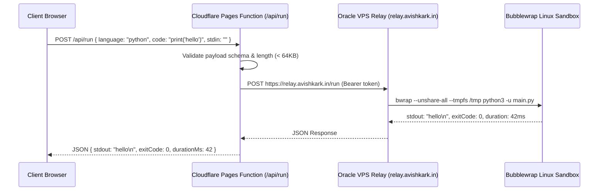
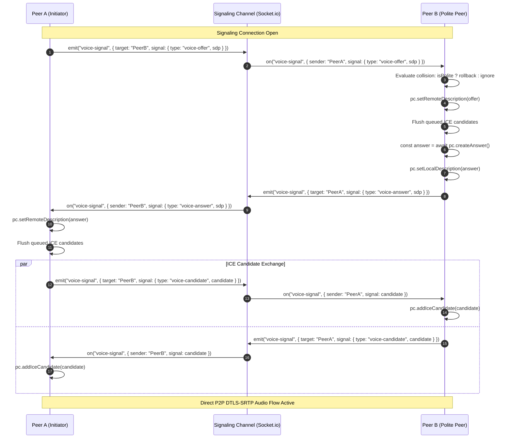
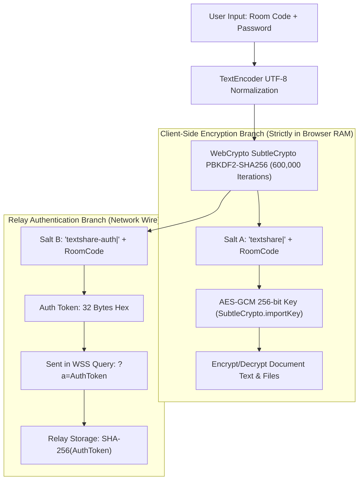

# anonshare — Comprehensive Technical Architecture Specification

> **Specification Standard:** Master Systems Engineering Architecture Blueprint  
> **Document Version:** 5.3.0-EXTENDED  
> **Target Environment:** Next.js 16 (Static Export) · Cloudflare Pages · Cloudflare Functions · Oracle VPS Relay · WebRTC Mesh  
> **Production URL:** [https://code.avishkark.in](https://code.avishkark.in)  
> **Relay Server:** [https://relay.avishkark.in](https://relay.avishkark.in)  

---

## 1. End-to-End System Topology

```mermaid
flowchart TB
    subgraph ClientLayer ["Client Browser Layer (Desktop & Mobile)"]
        UI["React 19 / Next.js 16 UI (Zustand 5 Master Store)"]
        WebCryptoSubsystem["WebCrypto Engine (AES-GCM 256 / PBKDF2 600k)"]
        YjsCRDTEngine["Yjs CRDT Document & Undo Manager"]
        WebRTCEngine["WebRTC VoiceMesh (DTLS-SRTP + Web Audio AnalyserNode)"]
        IDBStorage["IndexedDB Offline Persistence Layer (idb)"]
        LocalStorageSubsystem["LocalStorage (Bookmarks, Preferences, Theme)"]
    end

    subgraph EdgeCDN ["Cloudflare Pages Global Edge (code.avishkark.in)"]
        DistDirectory["Static Export HTML / CSS / JS Chunks (dist/)"]
        SecurityHeadersEngine["_headers Directive Processor (CSP, Caching, HSTS)"]
    end

    subgraph EdgeFunctions ["Cloudflare Pages Serverless Functions (functions/api/*)"]
        RunAPIEndpoint["/api/run (Compiler Execution Gateway)"]
        CryptoAPIEndpoint["/api/crypto (PBKDF2 Benchmarking Helper)"]
        StatusAPIEndpoint["/api/status (System Diagnostics & Latency Ping)"]
        GenAPIEndpoint["/api/generate (Generative UI Template Fallbacks)"]
    end

    subgraph RelayVPSHost ["Dedicated Oracle VPS Relay (relay.avishkark.in)"]
        WSServerEngine["WebSocket Binary Server (Node.js / ws)"]
        SocketIOServerEngine["Socket.io Mini-Service Engine (:3003)"]
        BubblewrapSandbox["Bubblewrap Linux Isolation Sandbox (gcc, python, node)"]
        SnapshotCompactor["In-Memory Snapshot Compaction & TTL Engine"]
    end

    subgraph PeerToPeerMesh ["Direct Peer-to-Peer WebRTC Audio Mesh"]
        PeerA["Peer Client A (Remote Audio Stream)"]
        PeerB["Peer Client B (Remote Audio Stream)"]
        PeerC["Peer Client C (Remote Audio Stream)"]
    end

    UI --> WebCryptoSubsystem
    UI --> YjsCRDTEngine
    UI --> WebRTCEngine
    YjsCRDTEngine <--> IDBStorage
    UI <--> LocalStorageSubsystem

    ClientLayer <-->|HTTP/3 Fetch (Static HTML, Chunks)| EdgeCDN
    ClientLayer <-->|JSON POST Requests| EdgeFunctions
    EdgeFunctions <-->|Proxy Code Execution| BubblewrapSandbox

    YjsCRDTEngine <-->|Encrypted Binary Frames (WSS)| WSServerEngine
    UI <-->|Presence, Chat, Cursor Events| SocketIOServerEngine
    WebRTCEngine <-->|SDP Offer/Answer & ICE Signaling| SocketIOServerEngine
    WSServerEngine <--> SnapshotCompactor

    WebRTCEngine <===>|Direct DTLS-SRTP P2P Audio| PeerA
    WebRTCEngine <===>|Direct DTLS-SRTP P2P Audio| PeerB
    WebRTCEngine <===>|Direct DTLS-SRTP P2P Audio| PeerC
```

---

## 2. Exhaustive Layer Specifications

### 2.1 Frontend & Application Architecture
- **Framework Core**: Next.js 16.3.5 utilizing React 19 Client Components (`"use client"`).
- **Compilation Mode**: Static Export (`output: "export"`, `distDir: "dist"` in `next.config.ts`).
- **State Store ([`store.ts`](file:///c:/Users/Dell/Desktop/textshare/src/lib/store.ts))**:
  - Centralized reactive state managed via Zustand 5 with immutable state updates.
  - Slice architecture covering: Editor Tabs, Participants, Room Lifecycle, Terminal Lines, Chat Messages, WebRTC Voice State, Notifications, Bookmarks, and UI Overlays.
- **Offline & Storage Strategy**:
  - `idb` / `y-indexeddb`: Persists local document CRDT state across network re-connections.
  - `localStorage`: Retains visited room bookmarks (`anonshare.bookmarks`), persistent identity color (`anonshare.color`), theme choice (`anonshare.theme`), and dismiss flags.

---

### 2.2 Cloudflare Pages Edge Layer & Content Security Policy (CSP)

```
+-----------------------------------------------------------------------------------------------------------------------+
|                                           HTTP Security Headers Specification                                         |
+------------------------------------+----------------------------------------------------------------------------------+
| Header Directive                   | Value & Operational Rationale                                                    |
+------------------------------------+----------------------------------------------------------------------------------+
| default-src                        | 'self' — Restricts default resource loading to origin                            |
| script-src                         | 'self' 'unsafe-inline' https://static.cloudflareinsights.com                     |
|                                    | (MANDATORY: 'unsafe-inline' enables React hydration payload execution)           |
| style-src                          | 'self' 'unsafe-inline' — Supports Tailwind inline CSS variables & style tags     |
| img-src                            | 'self' data: blob: https: — Supports encrypted image attachments and previews    |
| font-src                           | 'self' data: — Supports Geist and JetBrains Mono fonts                          |
| connect-src                        | 'self' https: wss: — Allows WSS relay and signaling connections                  |
| frame-src                          | 'self' https: blob: data: — Sandboxed live HTML preview iframes                  |
| worker-src                         | 'self' blob: — Allows Web Workers and Service Worker registration               |
| object-src                         | 'none' — Blocks legacy Flash and ActiveX plugins                                 |
| base-uri                           | 'self' — Prevents base tag hijacking                                             |
| form-action                        | 'none' — Disallows raw HTML form submissions                                     |
| frame-ancestors                    | 'none' (DENY) — Full clickjacking protection across all frames                   |
| X-Content-Type-Options             | nosniff — Prevents MIME-type sniffing vulnerabilities                            |
| Referrer-Policy                    | no-referrer — Zero referrer leaks to third parties                               |
| Strict-Transport-Security          | max-age=31536000; includeSubDomains (Enforces HTTPS across all subdomains)       |
+------------------------------------+----------------------------------------------------------------------------------+
```

---

### 2.3 Cloudflare Pages Functions Layer (`functions/api/`)

Because `output: "export"` disables Node.js server routes in Next.js, all dynamic serverless functions run directly as Cloudflare Pages Functions:



> **Client-Side vs Remote Sandbox Routing:**
> - **Native Languages (Python, C, C++, Java, Node.js, Go, Rust, Bash)**: Proxied via `/api/run` to the hardened bubblewrap sandbox on Oracle VPS with sanitized standard input (CRLF $\rightarrow$ LF, auto-terminating newline).
> - **Web Languages (HTML, SVG, Markdown)**: Rendered immediately on the client inside a sandboxed `<iframe>` with automatic linked CSS/JS project tab inlining, zero network latency, and live console stream capture.

---

### 2.4 Binary Relay Protocol & Frame Specifications ([`relay/server.js`](file:///c:/Users/Dell/Desktop/textshare/relay/server.js))

The relay server communicates with clients over binary WebSocket connections utilizing 1-byte opcode headers followed by payload bytes:

```
+---------------+-----------------------------------------------------------------+
| Byte Offset   | Field Name & Description                                        |
+---------------+-----------------------------------------------------------------+
| Byte 0        | Opcode (Type Indicator: 0x00 to 0x09)                           |
| Bytes 1..N    | Variable-length Payload (Encrypted Ciphertext, JSON, or Binary) |
+---------------+-----------------------------------------------------------------+
```

#### Protocol Opcode Matrix:
| Opcode | Hex | Identifier | Persistence | Broadcast Behavior |
|---|---|---|---|---|
| `0` | `0x00` | `T_UPDATE` | Appended to Room Log | Forwarded to all other room peers |
| `1` | `0x01` | `T_AWARE` | Transient (Never stored) | Ephemeral broadcast for cursor/presence |
| `2` | `0x02` | `T_SNAPSHOT`| Replaces Room Log | Sent on snapshot compaction |
| `3` | `0x03` | `T_SYNCED` | None | Signals client that backlog sync is complete |
| `4` | `0x04` | `T_ERROR` | None | Emits error code string to client |
| `5` | `0x05` | `T_COMPACT`| Triggers compaction | Requests server to compact log |
| `6` | `0x06` | `T_STATE` | Persisted in memory | Room metadata state (read-only, TTL) |
| `7` | `0x07` | `T_KILLED` | Purges room memory | Closes all connected WebSockets |
| `8` | `0x08` | `T_GRANT` | None | Owner grants edit rights to peer |
| `9` | `0x09` | `T_P2P` | Transient | WebRTC signaling frame routing |

---

### 2.5 Real-Time WebRTC Voice Mesh Protocol ([`voice.ts`](file:///c:/Users/Dell/Desktop/textshare/src/lib/voice.ts))



#### Audio Frequency & Volume Loop Math
Every $100\text{ ms}$, `VoiceMesh.monitorAudioActivity()` analyzes the active microphone stream:
1. `analyser.getByteFrequencyData(buffer)` fills a $128$-element frequency bin ($FFT=256$).
2. Average volume power is calculated:
   $$\bar{A} = \frac{1}{N} \sum_{i=0}^{N-1} \text{buffer}[i]$$
3. Normalized volume level ($0\dots 100\%$):
   $$L = \min\left(100, \text{round}\left(\frac{\bar{A}}{128} \times 100\right)\right)$$
4. Voice Activity Detection: If $\bar{A} > 20$, `setSpeaking(true)` triggers green avatar pulse rings.

---

### 2.6 Zero-Knowledge Cryptographic Derivation Engine



- **Salt Separation Guarantee**: Because $\text{Salt}_{\text{enc}} \neq \text{Salt}_{\text{auth}}$, observing the authentication token $T_{\text{auth}}$ on the network or compromising the relay database provides **zero mathematical leverage** to derive $K_{\text{enc}}$ or decrypt the document.

---

### 2.7 Collaborative Whiteboard CRDT Vector Engine

The collaborative whiteboard uses vector strokes synchronized deterministically over the E2EE Yjs CRDT document:
- **CRDT Structure**: `doc.getArray<WhiteboardStroke>("whiteboard_strokes")`.
- **Stroke Data Model**:
  ```ts
  interface WhiteboardStroke {
    id: string;
    tool: "pen" | "highlighter" | "eraser" | "line" | "rect" | "circle";
    color: string;
    size: number;
    points: { x: number; y: number }[];
    author?: string;
    authorColor?: string;
    timestamp: number;
  }
  ```
- **Local Smooth Rendering**: Points sampled via pointer events with pointer capture (`setPointerCapture(e.pointerId)`) on HTML5 `<canvas>`.
- **Highlighter Opacity**: Rendered with `ctx.globalAlpha = 0.35` and composited directly onto the vector layer.
- **Export Pipeline**: High-resolution PNG rasterization using `canvas.toBlob("image/png")` triggering automatic download.

