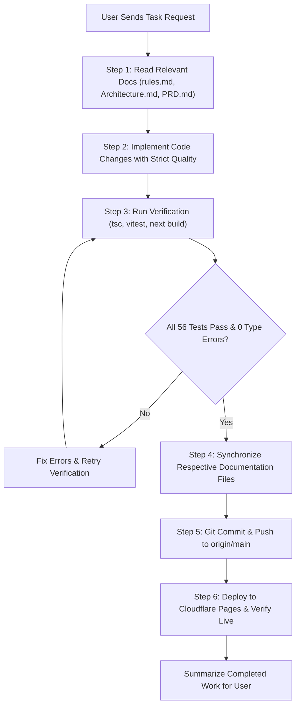

# anonshare — AI Agent Command & Continuous Documentation Protocol

> **Target Audience:** All AI Coding Assistants (Antigravity, Claude, Copilot, Cursor, etc.) and Human Contributors  
> **Enforcement Level:** **MANDATORY / AUTOMATIC ON EVERY TURN**  
> **Master Rule:** Whenever you make ANY change to this codebase, you **MUST** update the respective documentation files below before completing your task.

---

## 1. Mandatory File Update Mapping Matrix

Whenever you modify, add, or refactor code in `c:\Users\Dell\Desktop\textshare`, identify your change category and update the corresponding documentation file immediately:

```
+-----------------------------------------------------------------------------------------------------------------------+
|                                    Documentation Synchronization Routing Matrix                                       |
+-----------------------------------------+--------------------+--------------------------------------------------------+
| If your changes involve...              | Update File        | What to update in that file                            |
+-----------------------------------------+--------------------+--------------------------------------------------------+
| New feature, requirement, user story,   | PRD.md             | Update Section 4 (Functional Specs), User Personas,   |
| permission model, TTL, or limits        |                    | or System Limits Table.                                |
+-----------------------------------------+--------------------+--------------------------------------------------------+
| API endpoint, WebSocket frame opcode,   | Architecture.md    | Update Mermaid diagrams, Protocol Frame Matrix, Layer  |
| data flow, WebCrypto, WebRTC, VPS relay |                    | Specifications, or Directory Structure.                |
+-----------------------------------------+--------------------+--------------------------------------------------------+
| New invariant, security constraint,     | rules.md           | Add a numbered Rule with Bad vs Good code snippets,    |
| CSP policy, or banned anti-pattern      |                    | root causes, and verification checklists.              |
+-----------------------------------------+--------------------+--------------------------------------------------------+
| UI layout, component, color theme, CSS  | design.md          | Update Theme Token Matrix, Component Blueprints,       |
| variable, typography, or mobile #mbar   |                    | Z-Index Stack, or Responsive Touch specifications.     |
+-----------------------------------------+--------------------+--------------------------------------------------------+
| Bugfix, resolved issue, milestone, QA   | tasks.md           | Mark milestone checked in Section 1 & 2, log date,     |
| test case, or future roadmap adjustment |                    | and update Future Roadmap items.                       |
+-----------------------------------------+--------------------+--------------------------------------------------------+
| Bug post-mortem, debugging breakthrough,| memory.md          | Add an INC-XXXX entry in Section 1 (Symptoms, Root     |
| CSP trap, or agent troubleshooting guide|                    | Cause, Fix, Invariant), update Constants Table.       |
+-----------------------------------------+--------------------+--------------------------------------------------------+
```

---

## 2. Standard Operating Verification Commands

Execute these exact commands in sequence before committing or finalizing any work:

```bash
# -----------------------------------------------------------------
# 1. TypeScript Strict Type-Check (MUST EXIT WITH CODE 0)
# -----------------------------------------------------------------
npx tsc --noEmit

# -----------------------------------------------------------------
# 2. Automated Test Suite (ALL 56 TESTS MUST PASS)
# -----------------------------------------------------------------
npm test

# -----------------------------------------------------------------
# 3. Static Export Production Build (MUST COMPILE TO dist/)
# -----------------------------------------------------------------
npm run build

# -----------------------------------------------------------------
# 4. Verify Content-Security-Policy in dist/_headers
# -----------------------------------------------------------------
# MUST confirm 'unsafe-inline' is present in script-src & style-src:
grep "unsafe-inline" dist/_headers

# -----------------------------------------------------------------
# 5. Git Status Check (ZERO UNTRACKED BINARIES / SECRETS)
# -----------------------------------------------------------------
git status

# -----------------------------------------------------------------
# 6. Commit & Push Changes
# -----------------------------------------------------------------
git add .
git commit -m "feat/fix: description of changes + docs sync"
git push origin main

# -----------------------------------------------------------------
# 7. Deploy to Cloudflare Pages
# -----------------------------------------------------------------
npx wrangler pages deploy dist --project-name textshare --branch main

# -----------------------------------------------------------------
# 8. Verify Live HTTP Response Headers
# -----------------------------------------------------------------
curl -I https://code.avishkark.in
```

---

## 3. Agent Execution Lifecycle Guidelines



### Inviolable Golden Invariants for Every Agent:
1. **Never Remove `'unsafe-inline'` from `public/_headers`**: Next.js static exports will break React hydration immediately if `'unsafe-inline'` is missing.
2. **Never Commit Fake or Mock Data**: No `Math.random()` in audio meters, speaking avatars, or peer lists.
3. **Never Compromise Author Provenance**: Author is **Avishkar Kedar** ([https://avishkark.in](https://avishkark.in) · `avishkarkedar+text@gmail.com`).
4. **Never Create Dynamic Routes in `src/app/api/`**: All dynamic APIs belong in `functions/api/*.ts`.
5. **Never Leave Documentation Out of Sync**: Every pull request / commit must update the relevant `.md` files.
