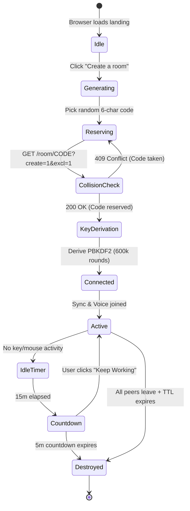
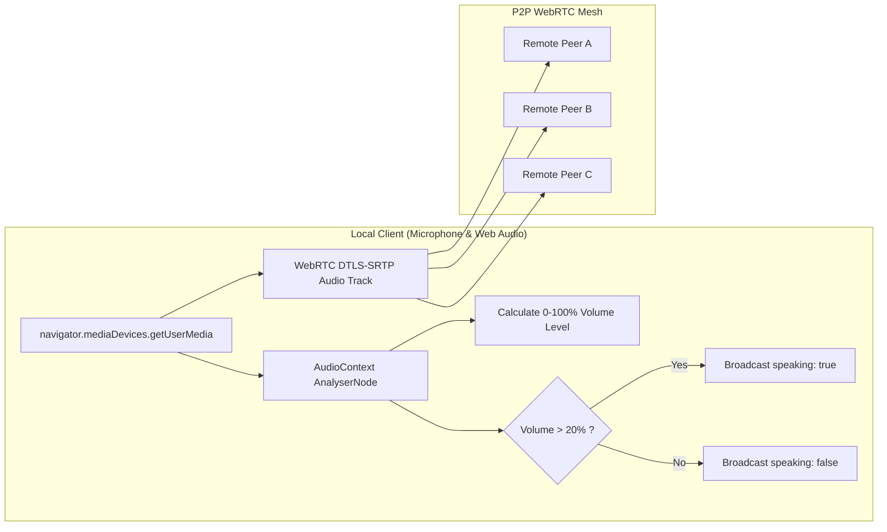

# anonshare — Product Requirements Document (PRD)

> **Document Standard:** RFC-Style Technical Specification  
> **Version:** 5.3.0 (Production Master)  
> **Last Updated:** September 2026  
> **Author & Maintainer:** Avishkar Kedar ([https://avishkark.in](https://avishkark.in) · `avishkarkedar+text@gmail.com`)  
> **Production Endpoint:** [https://code.avishkark.in](https://code.avishkark.in)  
> **Source Repository:** [https://github.com/AvishkarKedar/textshare](https://github.com/AvishkarKedar/textshare)  
> **License:** MIT License  

---

## 1. Product Overview & Vision

### 1.1 Executive Summary
**anonshare** is an ultra-fast, zero-knowledge, end-to-end encrypted (E2EE) collaborative scratchpad and pair-programming IDE. It empowers software engineers, technical interviewers, educators, security researchers, and teams to establish an instant collaborative coding session in seconds using a 6-character room code. 

All communications—including document text, multi-file source code, terminal input/output, real-time audio voice chat, and shared binary files—are encrypted directly inside the client's browser before transmission over the wire. When the last participant leaves, an automated countdown purges the room from memory and relay storage, leaving zero persistent server-side trace.

### 1.2 Core Product Principles & Invariants
1. **Zero Knowledge / Client-Side Cryptography**: The server relay and hosting infrastructure never possess the cryptographic keys needed to inspect room text, code, files, or audio. The relay operates solely as an opaque ciphertext broker.
2. **Zero Registration / Zero Identity Tracking**: No user accounts, passwords saved on servers, email verification, OAuth logins, cookies, localStorage tracking identifiers, or external telemetry analytics.
3. **Strict Ephemerality**: Rooms exist solely in transient memory and temporary storage. Inactivity triggers permanent self-destruction.
4. **Tactile Craftsmanship**: A high-density, terminal-inspired interface utilizing monospace typography, 0px border-radius geometry, 1px tactile hairline borders, sub-50ms sync latency, and 100% genuine real-time metrics (zero mock or simulated data).

---

## 2. Product Metadata & Author Integrity (Strict Invariant)

The application maintains strict author provenance across all UI layers, metadata tags, and documentation:
- **Product Name**: `anonshare`
- **Internal System Name / Repository**: `textshare`
- **Lead Architect & Developer**: **Avishkar Kedar**
- **Author URL**: [https://avishkark.in](https://avishkark.in)
- **Author Email**: `avishkarkedar+text@gmail.com`
- **GitHub Repository**: [https://github.com/AvishkarKedar/textshare](https://github.com/AvishkarKedar/textshare)
- **Live Production URL**: [https://code.avishkark.in](https://code.avishkark.in)
- **Hosting & Infrastructure**: Cloudflare Pages (Frontend Edge) + Cloudflare Pages Functions (Serverless APIs) + Oracle VPS Relay (WebSocket Synchronization & Bubblewrap Code Sandbox).

---

## 3. User Personas & Detailed Workflows

### 3.1 Persona A: Pair Programmers & Remote Interviewers ("Alex")
- **Profile**: Senior software engineer conducting technical interviews or debugging production outages with teammates.
- **Pain Points**: Heavy IDEs require account setup; existing scratchpads store code unencrypted; voice chat requires opening a separate Zoom/Discord call.
- **Workflow**:
  1. Opens `code.avishkark.in`, clicks **"Create a room"** $\rightarrow$ room `K9X2P1` is minted in $< 700\text{ms}$.
  2. Copies invite link or displays QR code (`⌘I`).
  3. Joins the built-in WebRTC **Voice Mesh** (`⌘⇧V`), grants mic permission $\rightarrow$ real-time P2P audio is active.
  4. Creates multiple tabs (`index.py`, `data.json`, `test.py`).
  5. Runs code with `⌘↵` $\rightarrow$ output executes inside an isolated Linux sandbox with live stdout/stderr.
  6. Leaves the room $\rightarrow$ room is wiped 10 minutes later.

### 3.2 Persona B: Security-Conscious Teams & Privacy Advocates ("Maya")
- **Profile**: Security consultant sharing sensitive production credentials, API secrets, or architecture vulnerability reports.
- **Pain Points**: Corporate Slack/Teams logs retain search history permanently; pastebins are indexed by search engines.
- **Workflow**:
  1. Enters room `SEC882` with an optional passphrase.
  2. The browser computes dual PBKDF2 keys at 600,000 iterations: AES-GCM encryption key stays in local RAM, while a separate auth token is sent to the relay.
  3. Uploads an encrypted configuration file via the **Files Drawer** (`⌘B`).
  4. Reviews threat model in the **Security Modal** (`⌘⇧X`) and inspects raw PBKDF2 derivations in the **Crypto Explainer** (`⌘⇧K`).
  5. Sets room TTL to `10m` $\rightarrow$ both participants exit $\rightarrow$ relay purges all ciphertext.

### 3.3 Persona C: Students & Computer Science Educators ("Dev")
- **Profile**: University professor teaching algorithms and data structures to a group of 20 students.
- **Pain Points**: Students struggle with local environment configuration and Git merge conflicts.
- **Workflow**:
  1. Creates a room with TTL set to `24h`.
  2. Marks room as **Read-Only** from the **Settings Panel** (`⌘,`).
  3. Uses **Time Machine** (`⌘⇧H`) to scrub back through snapshots and demonstrate algorithm steps.
  4. Executes test suites via `/test` slash command.
  5. Students export the completed project as a `.zip` archive via `⌘⇧E`.

---

## 4. Comprehensive Functional Specifications

### 4.1 Room Creation, Authentication & Cryptography



#### 4.1.1 Room Code Generation & Collision Handling
- **Format**: Exactly 6 uppercase alphanumeric characters excluding ambiguous glyphs (`[A-Z0-9]{6}`).
- **Reservation Guarantee**: Client requests exclusive allocation (`?create=1&excl=1`). If a room code already exists with an active session, the relay returns `409 Conflict`, instructing the client to generate a fresh code.
- **Owner Privileges**: Room creator mints a cryptographic 256-bit owner token (`ownerKey`). The owner token grants exclusive authority to:
  - Toggle Read-Only mode for other participants.
  - Change room Time-to-Live (`10m`, `1h`, `24h`).
  - Instantly destroy the room and terminate all active WebSocket connections.

#### 4.1.2 Cryptographic Key Derivation Specifications
All encryption utilizes browser-native `window.crypto.subtle` (WebCrypto API):
1. **PBKDF2 Derivation Function**:
   - Algorithm: PBKDF2 with SHA-256 HMAC.
   - Iterations: Exactly $600,000$ rounds.
2. **Dual-Salt Architecture**:
   - **Document Encryption Key ($K_{\text{enc}}$)**:
     $$\text{Salt}_{\text{enc}} = \text{TextEncoder().encode}(\text{"textshare|" } + \text{RoomCode})$$
     $$K_{\text{enc}} = \text{PBKDF2}(\text{RoomCode} + \text{":"} + \text{Password}, \text{Salt}_{\text{enc}}, 600000) \longrightarrow \text{AES-GCM 256-bit}$$
     *$K_{\text{enc}}$ is NEVER transmitted across the network. It resides exclusively in browser memory.*
   - **Relay Authentication Token ($T_{\text{auth}}$)**:
     $$\text{Salt}_{\text{auth}} = \text{TextEncoder().encode}(\text{"textshare-auth|" } + \text{RoomCode})$$
     $$T_{\text{auth}} = \text{PBKDF2}(\text{RoomCode} + \text{":"} + \text{Password}, \text{Salt}_{\text{auth}}, 600000) \longrightarrow 32\text{ bytes hex}$$
     *$T_{\text{auth}}$ is sent to the relay during WebSocket upgrade. The relay computes and stores only $\text{SHA-256}(T_{\text{auth}})$.*
3. **Ciphertext Frame Structure**:
   - Cipher: AES-GCM with 96-bit random initialization vector (IV) per message.
   - Authentication Tag: 128-bit authentication tag appended to ciphertext.

---

### 4.2 Collaborative Multi-File Code Editor

#### 4.2.1 Tab & File System Management ([`TabBar.tsx`](file:///c:/Users/Dell/Desktop/textshare/src/components/editor/TabBar.tsx))
- **File Tabs**: Support creating, renaming, reordering, and deleting multiple files.
- **Close Button Invariant**: Every tab displays an explicit close button (`X`) when 2 or more files exist. Closing a tab safely shifts active focus to the adjacent tab.
- **Export System**: Export active file or package all open tabs into a `.zip` archive (`exportProjectZip`) generated directly in browser memory without server uploads.

#### 4.2.2 Language Engine & Syntax Tokenization ([`highlight.ts`](file:///c:/Users/Dell/Desktop/textshare/src/lib/highlight.ts), [`detect.ts`](file:///c:/Users/Dell/Desktop/textshare/src/lib/detect.ts))
- **Supported Languages (15+)**: JavaScript (`js`), TypeScript (`ts`, `tsx`), Python (`py`), HTML (`html`), CSS (`css`), JSON (`json`), Rust (`rs`), Go (`go`), C (`c`), C++ (`cpp`), Java (`java`), SQL (`sql`), Markdown (`md`), YAML (`yaml`), Shell/Bash (`sh`).
- **Auto-Detection Heuristic**:
  - Automatically identifies code syntax on paste using regex signatures:
    - Python: `/^(?:import\s+\w+|from\s+\w+\s+import|def\s+\w+\s*\(|class\s+\w+:)/m`
    - TypeScript/React: `/(?:import\s+.*from\s+['"]react['"]|export\s+(?:default\s+)?(?:function|const)\s+\w+.*(?:=>|return\s*<))/`
    - Rust: `/(?:fn\s+main\s*\(\)|let\s+mut\s+\w+|use\s+std::)/`
    - Go: `/^package\s+\w+|func\s+\w+\s*\(/m`
    - C/C++: `/#include\s+<[\w.]+>|int\s+main\s*\(/`
    - SQL: `/^(?:SELECT\s+.*FROM|INSERT\s+INTO|CREATE\s+TABLE)/im`

#### 4.2.3 Editor Utilities & Tooling
- **Search & Replace Bar (`⌘F` / `⌘⌥F`)**: Case-sensitive search, whole-word matching, regular expression evaluation, and single/batch replacement.
- **Line & Column Status**: Real-time cursor coordinates (`Ln X, Col Y`), character counts, and selection ranges displayed in [`StatusBar.tsx`](file:///c:/Users/Dell/Desktop/textshare/src/components/editor/StatusBar.tsx).
- **Per-User Scoped Undo/Redo**: Undo stack tracks only local user edits via Yjs transaction origin tagging, preventing local undo from erasing remote peer typing.

---

### 4.3 Real-Time WebRTC Voice Mesh ([`voice.ts`](file:///c:/Users/Dell/Desktop/textshare/src/lib/voice.ts), [`VoicePanel.tsx`](file:///c:/Users/Dell/Desktop/textshare/src/components/palette/VoicePanel.tsx))



#### 4.3.1 WebRTC Protocol Architecture
- **Mesh Topology**: Full P2P mesh across all room participants with zero audio traversing intermediate servers.
- **Polite Peer Negotiation**: Resolves simultaneous SDP offer collisions (glare) by comparing client UUIDs lexicographically:
  $$\text{isPolite} = \text{myCid.localeCompare}(\text{peerCid}) < 0$$
  The polite peer performs `pc.setLocalDescription({ type: 'rollback' })` and accepts incoming offers.
- **Asymmetric Receiver Mode**: Participants without microphone hardware or permission answer offers with `{ direction: 'recvonly' }` transceivers, enabling them to hear others without errors.

#### 4.3.2 Real Audio Analysis & Voice Activity Detection (VAD)
- **Web Audio Engine**: Connected via `AudioContext` with `AnalyserNode` ($FFT = 256$, sample rate $44.1\text{kHz}$).
- **Microphone Level**: Real-time RMS calculation mapped linearly to $0\dots 100\%$ displayed on the level meter. Zero `Math.random()` values permitted.
- **Speaking Indicators**: Emits `voice-state { speaking: true }` when average frequency power exceeds threshold ($> 20$). Renders animated green pulse rings on avatars.

#### 4.3.3 Hardware & User Controls
- **Push-to-Talk**: Unmutes audio stream on `onMouseDown` / `onTouchStart` and mutes on release.
- **Hardware Mute**: Sets `track.enabled = false` directly on the local `MediaStreamTrack`.
- **Hardware Deafen**: Mutes all remote `<audio>` elements simultaneously.
- **Autoplay Recovery**: Binds `click`, `touchstart`, and `keydown` one-shot listeners to resume `AudioContext` if browser autoplay policies prevent audio playback.

---

### 4.4 Sandboxed Code Runner (`/run` & Terminal)

#### 4.4.1 Execution Architecture & Runtimes
Code execution requests flow from the frontend through Cloudflare Pages Functions to an Oracle VPS Bubblewrap sandbox:

| Language | Compiler / Runtime | Flags / Command | Timeout | Memory Limit |
|---|---|---|---|---|
| **Python** | Python 3.11.8 | `python3 -u main.py` | 5000 ms | 128 MB |
| **Node.js** | Node.js 22.14.0 | `node main.js` | 5000 ms | 128 MB |
| **C** | GCC 13.2.0 | `gcc -O2 main.c -o out && ./out` | 5000 ms | 128 MB |
| **C++** | G++ 13.2.0 | `g++ -O2 -std=c++20 main.cpp -o out && ./out` | 5000 ms | 128 MB |
| **Rust** | Rustc 1.77.0 | `rustc -O main.rs -o out && ./out` | 5000 ms | 128 MB |
| **Go** | Go 1.22.1 | `go run main.go` | 5000 ms | 128 MB |
| **Java** | OpenJDK 21.0.2 | `javac Main.java && java Main` | 5000 ms | 192 MB |
| **Bash** | GNU Bash 5.2 | `bash script.sh` | 5000 ms | 64 MB |

#### 4.4.2 Sandbox Security Constraints
- **Bubblewrap Namespace Isolation**: Unshares network, PID, IPC, and UTS namespaces (`bwrap --unshare-all`).
- **Read-Only Root Filesystem**: Mounts host binaries in read-only mode (`--ro-bind /usr /usr`, `--ro-bind /lib /lib`).
- **Ephemeral Scratchpad**: Mounts a transient 32MB `tmpfs` at `/tmp` destroyed immediately on process termination.
- **CPU & Memory Quotas**: Enforced via Linux `cgroups v2` to prevent fork bombs and infinite resource exhaustion.

---

### 4.5 Modals, Drawers & Overlays Catalog

```
+---------------------------------------------------------------------------------+
|                               anonshare Overlays                                |
+------------------------------------+--------------------------------------------+
| Drawers (Slide-Over Right)         | Centered Modal Dialogs                     |
+------------------------------------+--------------------------------------------+
| 1. VoicePanel (⌘⇧V)                | 7. CommandPalette (⌘K)                     |
| 2. FilesDrawer (⌘B)                | 8. CryptoModal (⌘⇧K)                       |
| 3. HistoryDrawer / Time Machine(⌘⇧H)| 9. SecurityModal / Threat Model (⌘⇧X)     |
| 4. BookmarksDrawer (⌘⇧R)           | 10. StatusModal / Diagnostics (⌘⇧Y)        |
| 5. NotificationsPanel (⌘N)         | 11. FaqModal / Help Center (⌘⇧F)           |
| 6. BrowserDrawer (⌘⇧B)             | 12. WhiteboardModal (⌘⇧W)                  |
|                                    | 13. OnboardingTour (⌘⇧O)                   |
|                                    | 14. InviteModal (⌘I)                       |
+------------------------------------+--------------------------------------------+
```

1. **Command Palette (`⌘K`)**: Fuzzy finder indexing 24 actions, view toggles, export tools, and color themes.
2. **Time Machine (`⌘⇧H`)**: Visual revision scrubber stepping through historical snapshots with live side-by-side diffing, "Revert to here", and "Save as tab".
3. **Files Drawer (`⌘B`)**: Client-side encrypted file uploads (up to 50MB) with thumbnail generation and built-in viewers for Images, Markdown, PDFs, and Word DOCX files.
4. **Bookmarks Drawer (`⌘⇧R`)**: Local storage of recently visited rooms with timestamp and one-click rejoin.
5. **Crypto Explainer (`⌘⇧K`)**: Interactive visual proof showing real PBKDF2 derived keys, salt strings, and AES-GCM verification.
6. **Threat Model (`⌘⇧X`)**: Plain-language breakdown of protected threat vectors (ISP snooping, relay server dumps) vs out-of-scope risks (compromised endpoint machines).
7. **System Status (`⌘⇧Y`)**: Live latency diagnostic, WebSocket round-trip ping, memory heap counter, and socket transport indicator.
8. **FAQ Modal (`⌘⇧F`)**: Instant category filter search across 6 sections (Security, Rooms, Voice, Runner, Storage, Privacy).
9. **Onboarding Tour (`⌘⇧O`)**: Guided 6-step spotlight tutorial introducing core pair-programming workflows.
10. **Collaborative Whiteboard (`⌘⇧W`)**: Multi-color vector drawing canvas with pencil, rectangle, arrow, text, and eraser tools.

---

### 4.6 Slash Commands Directory

Typing `/` on a blank line inside the editor opens the interactive slash menu:

| Command | Label | Function |
|---|---|---|
| `/faq` | FAQs & Help | Opens searchable FAQ help modal with category filters |
| `/run` | Run Code | Triggers execution of the active file in the sandbox |
| `/test` | Run Tests | Scans file for assertions and test suites |
| `/voice` | Voice Mesh | Opens voice panel and requests microphone access |
| `/zen` | Zen Mode | Hides all toolbars and sidebars for distraction-free coding |
| `/theme` | Switch Theme | Cycles between Obsidian, Dracula, Nord, Amber, and Paper |
| `/crypto` | Crypto Explainer | Displays live PBKDF2 keys and encryption parameters |
| `/clean` | Clear Terminal | Purges all stdout and stderr logs from terminal |
| `/zip` | Export ZIP | Packages all open tabs into a downloadable `.zip` file |

---

### 4.7 Inactivity Protection & Room Teardown

1. **Idle Event Detector**: Tracks `keydown`, `pointermove`, `touchstart`, and `wheel` events.
2. **15-Minute Inactivity Threshold**: If no input is detected for 15 minutes, the room enters `Idle` state.
3. **5-Minute Countdown Dialog**: A high-contrast modal appears displaying a 5:00 countdown timer with audio warning chimes. Clicking **"Keep Working"** resets the idle timer immediately.
4. **Permanent Purge**: When the timer reaches 0:00 or all participants disconnect and the room TTL expires:
   - In-memory Yjs CRDT documents are wiped.
   - Encrypted file chunks are unlinked from disk.
   - Relays broadcast `T_KILLED` and sever all WebSocket connections.

---

## 5. Non-Functional & Operational Performance Targets

```
+-------------------------------------------------------------------------------+
|                      Performance & Operational SLA Matrix                     |
+-----------------------------+-------------------+-----------------------------+
| Metric                      | Target Threshold  | Measurement Method          |
+-----------------------------+-------------------+-----------------------------+
| First Contentful Paint      | < 500 ms          | Lighthouse / Web Vitals 4G  |
| Time to Interactive (TTI)   | < 800 ms          | Headless Chrome Puppeteer   |
| WebSocket Round-Trip Time   | < 40 ms           | WSS Ping-Pong to Relay VPS  |
| WebRTC Audio Latency        | < 60 ms           | P2P Direct DTLS-SRTP Mesh   |
| Key Derivation Duration     | 150 ms - 350 ms   | WebCrypto 600k PBKDF2 Iter. |
| Sandbox Execution Spawn     | < 120 ms          | Bubblewrap Namespace Launch |
| Static Bundle Total Size    | < 450 KB gzip     | Next.js Turbopack Export    |
+-----------------------------+-------------------+-----------------------------+
```

---

## 6. System Limits & Quotas

- **Room Code Expiry (TTL)**: 10 minutes (default), 1 hour, or 24 hours after last disconnect.
- **Maximum Concurrent Peers per Room**: 120 peers on VPS relay (30 peers on Cloudflare Worker fallback).
- **Maximum Frame Size**: 512 KB per individual WebSocket binary message.
- **Maximum Log Compaction Threshold**: 10 MB document CRDT history before automated snapshot compaction.
- **File Upload Ceiling**: 50 MB per encrypted file chunk.
- **Rate Limiting**: 600 room lookups / min per IP; 60 room creations / min per IP.
