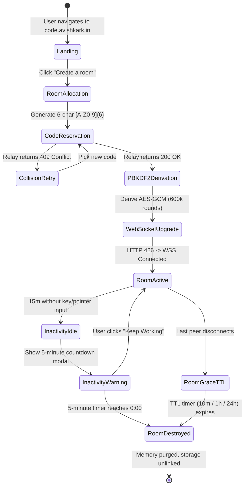
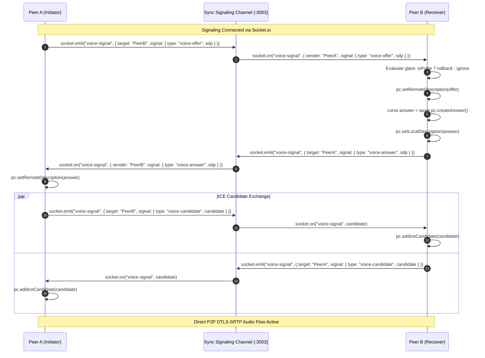

# anonshare — Product Requirements Document (PRD)

> **Document Type:** Master Product & Engineering Requirements Specification (RFC-Standard)  
> **Document Version:** 5.3.0-EXTENDED  
> **Release Target:** Production Baseline  
> **Author & Project Architect:** Avishkar Kedar ([https://avishkark.in](https://avishkark.in) · `avishkarkedar+text@gmail.com`)  
> **Production URL:** [https://code.avishkark.in](https://code.avishkark.in)  
> **Repository:** [https://github.com/AvishkarKedar/textshare](https://github.com/AvishkarKedar/textshare)  
> **License:** MIT License  

---

## 1. Executive Summary, Philosophy & Terminology

### 1.1 Executive Summary
**anonshare** is an ultra-fast, zero-knowledge, end-to-end encrypted (E2EE) collaborative scratchpad and pair-programming IDE designed for developers, technical interviewers, educators, and security researchers. Users create or join a collaborative workspace in under a second using a 6-character room code. 

All communications—multi-file source code, terminal input/output, real-time voice audio, cursor awareness, and binary attachments—are encrypted directly in the client browser using WebCrypto AES-GCM before leaving the machine. The server infrastructure (Cloudflare Pages, Cloudflare Functions, Oracle VPS Relay) operates as a zero-knowledge transport broker, forwarding opaque ciphertext frames without possessing the keys to decrypt or inspect room content. When all participants exit or the room reaches its Time-To-Live (TTL) expiration, all room state is permanently purged from memory and storage.

### 1.2 Core Product Principles & Non-Negotiables
1. **Zero Knowledge by Design**: The server relay never receives plaintext document text, voice audio, file uploads, or encryption keys. Decryption keys exist exclusively in ephemeral client RAM.
2. **Zero Identity Tracking**: No accounts, passwords stored on servers, email verifications, OAuth providers, tracking cookies, advertising pixels, or telemetry beacons.
3. **Strict Ephemerality**: Rooms, chats, files, and audio sessions exist only during active participation. Disconnection and TTL expiration trigger permanent self-destruction.
4. **Tactile Craftsmanship**: Dense, high-contrast monospace typography, 0px sharp-corner geometry, 1px tactile hairlines, $< 50\text{ ms}$ synchronization latency, and 100% genuine real-time metrics (zero simulated or mock data).

### 1.3 Terminology & Technical Glossary
- **CRDT (Conflict-Free Replicated Data Type)**: A data structure that converges deterministically across distributed peers without central lock arbitration (implemented via Yjs).
- **Awareness**: Ephemeral state sharing (presence, cursor line/column coordinates, active selection, identity color, and typing indicator) distributed among room peers.
- **Glare / Offer Collision**: A WebRTC condition where two peers simultaneously transmit an SDP offer to each other. Resolved via deterministic *Polite Peer Negotiation*.
- **Polite Peer**: The peer designated to yield (rollback its local offer) upon an offer collision based on lexicographical UUID sorting.
- **DTLS-SRTP**: Datagram Transport Layer Security / Secure Real-Time Transport Protocol used for encrypting WebRTC voice media packets.
- **PBKDF2**: Password-Based Key Derivation Function 2 with SHA-256 HMAC executed at $600,000$ iterations.
- **AES-GCM**: Advanced Encryption Standard in Galois/Counter Mode providing authenticated symmetric encryption with 96-bit initialization vectors (IV) and 128-bit authentication tags.
- **VAD (Voice Activity Detection)**: Real-time amplitude and frequency analysis powered by the Web Audio API (`AnalyserNode`) detecting active speech without server processing.
- **Bubblewrap (`bwrap`)**: Low-level Linux unprivileged user namespace sandbox enforcing strict file system isolation, cgroup memory ceilings, and read-only system mounts during code execution.

---

## 2. Author Provenance & Credential Integrity (Strict Invariant)

The system maintains strict attribution to its author across all legal notices, metadata schemas, documentation, and user interfaces:
- **Author & Architect**: **Avishkar Kedar**
- **Personal Website**: [https://avishkark.in](https://avishkark.in)
- **Contact Email**: [avishkarkedar+text@gmail.com](mailto:avishkarkedar+text@gmail.com)
- **Source Code Repository**: [https://github.com/AvishkarKedar/textshare](https://github.com/AvishkarKedar/textshare)
- **Production Host**: [https://code.avishkark.in](https://code.avishkark.in)
- **Relay VPS Host**: `https://relay.avishkark.in` (`wss://relay.avishkark.in`)
- **License**: MIT License (Permissive open source)

---

## 3. User Personas & Exhaustive Journey Workflows

```
+-----------------------------------------------------------------------------------------------------------------------+
|                                              User Persona Specifications                                              |
+---------------------+-------------------------------+-----------------------------------+-----------------------------+
| Persona             | Role / Environment            | Key Pain Points Addressed         | Primary Features Utilized   |
+---------------------+-------------------------------+-----------------------------------+-----------------------------+
| Alex (Pair Coder)   | Senior Engineer / Remote Team | Heavy IDE setup, video call lag,  | Multi-file tabs, CodeRunner |
|                     |                               | lack of live stdin/stdout         | WebRTC voice mesh, Diff view|
+---------------------+-------------------------------+-----------------------------------+-----------------------------+
| Maya (Security Eng) | Pentester / SecOps Team       | Permanent logs in Slack/Teams,    | Zero-knowledge PBKDF2 crypto|
|                     |                               | public pastebin scraping          | 10m TTL, Threat model modal |
+---------------------+-------------------------------+-----------------------------------+-----------------------------+
| Dev (CS Instructor) | Professor / 30-Student Lab    | Local compiler install issues,    | Read-only mode, Time machine|
|                     |                               | students breaking starter code    | /test assertion suite, ZIP  |
+---------------------+-------------------------------+-----------------------------------+-----------------------------+
| Sam (Mobile Coder)  | Developer on Phone / Tablet   | Tiny buttons, broken hover states,| #mbar mobile bar, 44px touch|
|                     |                               | viewport zoom glitches            | responsive drawer sheets    |
+---------------------+-------------------------------+-----------------------------------+-----------------------------+
```

### 3.1 Step-by-Step Scenario: Pair Programming Technical Interview
1. **Creation**: Alex opens `https://code.avishkark.in`, clicks **"Create a room"**. The client generates a random 6-character code (`X8K2M9`), verifies exclusivity with the relay via `GET /room/X8K2M9?create=1&excl=1` ($200\text{ OK}$), and mints a 256-bit owner token saved in `localStorage`.
2. **Invitation**: Alex presses `⌘I` to open the **Invite Modal**, copies the link `https://code.avishkark.in/#X8K2M9`, and sends it to the candidate.
3. **Voice Connection**: Alex clicks the microphone icon (`⌘⇧V`), browser prompts for microphone permission. Upon acceptance, `VoiceMesh` connects to `https://relay.avishkark.in`, sets up Web Audio `AnalyserNode` monitoring, and listens for candidate offers.
4. **Candidate Arrival**: The candidate opens the link. The client computes PBKDF2 keys, connects to the WebSocket relay, and emits `join`. Candidate joins voice; `VoiceMesh` establishes a direct P2P DTLS-SRTP audio stream with Alex.
5. **Coding & Tab Management**: Alex creates `solution.py` and `tests.py`. Both collaborate in real-time with multi-cursor presence and syntax highlighting.
6. **Execution & Stdin Input**: Alex presses `⌘↵` to execute `solution.py`. The request routes to `/api/run` $\rightarrow$ VPS Bubblewrap sandbox. Output streams into the **Terminal Panel** with exit code and duration ($42\text{ ms}$).
7. **Session Teardown**: Both participants close their browser tabs. The relay's 10-minute countdown ticker starts. At $0:00$, the room buffer is purged from VPS RAM.

---

## 4. Comprehensive Functional Specifications

### 4.1 Room Lifecycle & Cryptographic Specifications



#### 4.1.1 Room Code Allocation & HTTP Status Protocol
- **Room Code Alphabet**: `ABCDEFGHJKLMNPQRSTUVWXYZ23456789` (32 characters; excludes ambiguous glyphs `0`, `O`, `1`, `I`). Total namespace: $32^6 = 1,073,741,824$ unique rooms.
- **Relay Handshake Status Codes**:
  - `426 Upgrade Required`: Auth token accepted, client proceeds to WebSocket upgrade (`wss://relay.avishkark.in/room/CODE?a=AUTH`).
  - `403 Forbidden`: Auth token invalid / wrong password.
  - `404 Not Found`: Room does not exist or has expired.
  - `409 Conflict`: Room code already occupied during exclusive creation attempt.
  - `423 Locked / Suspended`: Room has been locked or suspended by the room owner.

#### 4.1.2 Dual-Salt PBKDF2 Mathematical Formulation
Every room session derives two cryptographically independent keys from the user password (or default empty password) and room code:

$$\text{PasswordString} = \text{RoomCode} \parallel \text{":"} \parallel \text{UserPassword}$$

1. **Document Encryption Key ($K_{\text{enc}}$)**:
   $$\text{Salt}_{\text{enc}} = \text{TextEncoder("textshare|" } \parallel \text{RoomCode)}$$
   $$K_{\text{enc}} = \text{PBKDF2-HMAC-SHA256}(\text{PasswordString}, \text{Salt}_{\text{enc}}, \text{iterations}=600000, \text{keyLength}=256\text{ bits})$$
   *Exported as `CryptoKey` with algorithm `AES-GCM`. Stored exclusively in local JavaScript variable scope.*

2. **Relay Authentication Token ($T_{\text{auth}}$)**:
   $$\text{Salt}_{\text{auth}} = \text{TextEncoder("textshare-auth|" } \parallel \text{RoomCode)}$$
   $$T_{\text{auth}} = \text{PBKDF2-HMAC-SHA256}(\text{PasswordString}, \text{Salt}_{\text{auth}}, \text{iterations}=600000, \text{keyLength}=256\text{ bits}) \longrightarrow \text{Hex String}$$
   *Transmitted to relay over TLS. The relay stores $\text{SHA-256}(T_{\text{auth}})$ to verify subsequent join attempts.*

3. **AES-GCM Frame Encryption Protocol**:
   - For every outbound binary frame $M$:
     $$\text{IV} \xleftarrow{\text{RNG}} \text{crypto.getRandomValues}(\text{new Uint8Array}(12)) \quad (96\text{ bits})$$
     $$C, \text{Tag} = \text{SubtleCrypto.encrypt}(\{\text{name: "AES-GCM", iv: IV}\}, K_{\text{enc}}, M)$$
     $$\text{OutboundPacket} = \text{IV} \parallel C \parallel \text{Tag}$$

---

### 4.2 Multi-File Editor & Language Engine Specifications

#### 4.2.1 Multi-File Tab Management ([`TabBar.tsx`](file:///c:/Users/Dell/Desktop/textshare/src/components/editor/TabBar.tsx))
- **File Buffer Model**:
  ```ts
  export interface EditorFile {
    id: string;        // UUIDv4 (e.g., "f-1726789012-abc")
    name: string;      // Filename with extension (e.g., "main.py")
    language: string;  // Canonical language identifier (e.g., "python")
    content: string;   // Full document text content
  }
  ```
- **Tab Invariants**:
  - Closing an active tab automatically activates the adjacent left tab (or right if at index 0).
  - Close button (`X`) is visible on hover (desktop) and permanently visible on touch screens when `files.length >= 2`.
  - Adding a new tab defaults to `untitled-{n}.js` and focuses the editor immediately.
  - Export Project as ZIP (`⌘⇧E`) executes client-side via `buildZip()` and triggers an immediate browser file download.

#### 4.2.2 Language Syntax Engine & Grammar Tokenizer ([`highlight.ts`](file:///c:/Users/Dell/Desktop/textshare/src/lib/highlight.ts))
Tokenizes 15+ grammars using high-speed regular expressions into categorized syntax tokens:
```ts
export interface SyntaxToken {
  type: "keyword" | "string" | "comment" | "number" | "function" | "operator" | "plain";
  value: string;
}
```
- **Language Detection Table**:

| Language | Recognized Extensions | Heuristic Paste Signatures |
|---|---|---|
| **Python** | `.py`, `.pyw`, `.ipynb` | `/^(?:import\s+\w+|from\s+\w+\s+import|def\s+\w+\s*\(|class\s+\w+:)/m` |
| **TypeScript** | `.ts`, `.tsx`, `.mts` | `/(?:import\s+.*from\s+['"]react['"]|export\s+(?:default\s+)?(?:function|const)\s+\w+.*(?:=>|return\s*<)|interface\s+\w+)/` |
| **JavaScript** | `.js`, `.jsx`, `.mjs` | `/(?:const\s+\w+\s*=|let\s+\w+\s*=|function\s+\w+\s*\(|console\.log\()/` |
| **Rust** | `.rs` | `/(?:fn\s+main\s*\(\)|let\s+mut\s+\w+|use\s+std::|impl\s+\w+)/` |
| **Go** | `.go` | `/^package\s+\w+|func\s+\w+\s*\(|import\s+\(\s*"/m` |
| **C / C++** | `.c`, `.cpp`, `.h`, `.hpp` | `/#include\s+<[\w.]+>|int\s+main\s*\(/` |
| **Java** | `.java` | `/(?:public\s+class\s+\w+|public\s+static\s+void\s+main)/` |
| **SQL** | `.sql` | `/^(?:SELECT\s+.*FROM|INSERT\s+INTO|CREATE\s+TABLE|UPDATE\s+\w+\s+SET)/im` |
| **HTML / SVG** | `.html`, `.svg` | `/<!DOCTYPE\s+html>|<html|<svg/i` |
| **JSON** | `.json` | `/^\s*[\{\[][\s\S]*[\}\]]\s*$/` |
| **Markdown** | `.md`, `.markdown` | `/^#{1,6}\s+|^\s*[-*+]\s+|\[.*\]\(.*\)/m` |

---

### 4.3 Real-Time WebRTC Voice Mesh Specifications ([`voice.ts`](file:///c:/Users/Dell/Desktop/textshare/src/lib/voice.ts))



#### 4.3.1 Web Audio Frequency Analysis & VAD Algorithm
Every $100\text{ ms}$, the local audio monitor executes:
1. `analyser.getByteFrequencyData(buffer)` fills $128$ frequency bins ($FFT = 256$, sample rate $44.1\text{ kHz}$).
2. Computes mean frequency amplitude:
   $$\bar{A} = \frac{1}{128} \sum_{i=0}^{127} \text{buffer}[i]$$
3. Computes normalized microphone volume percentage ($0\dots 100\%$):
   $$\text{VolumeLevel} = \min\left(100, \text{round}\left(\frac{\bar{A}}{128} \times 100\right)\right)$$
4. Voice Activity Detection: If $\bar{A} > 20$, updates `voice.speaking = true` and broadcasts `voice-state { speaking: true }`. If $\bar{A} \le 20$, sets `voice.speaking = false`.

#### 4.3.2 Hardware Controls & Autoplay Recovery
- **Hardware Mute**: `localStream.getAudioTracks().forEach(t => t.enabled = !muted)`. Emits `voice-state { muted }`.
- **Hardware Deafen**: Sets `audioEl.muted = true` on all peer audio elements.
- **Push-to-Talk**: Unmutes microphone on `onMouseDown` / `onTouchStart` and mutes on `onMouseUp` / `onTouchEnd`.
- **Autoplay Recovery**: If browser blocks `<audio>.play()`, attaches one-shot `click`, `touchstart`, and `keydown` listeners to resume `AudioContext` and trigger audio playback upon user interaction.

---

### 4.4 Sandboxed Code Execution Engine (`/run`)

#### 4.4.1 Execution Request Pipeline
1. Client issues `POST /api/run` with body `{ language, code, stdin }`.
2. Cloudflare Pages Function (`functions/api/run.ts`) validates payload size ($< 64\text{ KB}$) and supported language identifiers.
3. Function proxies request over HTTPS to Oracle VPS Relay (`https://relay.avishkark.in/run`).
4. VPS executes process inside Bubblewrap sandbox with CPU execution timeout ($5000\text{ ms}$) and memory limits ($128\text{ MB}$).
5. Returns JSON `{ stdout, stderr, exitCode, durationMs }` to client terminal panel.

#### 4.4.2 Sandbox Security Flags (`bwrap`)
```bash
bwrap \
  --unshare-all \
  --ro-bind /usr /usr \
  --ro-bind /lib /lib \
  --ro-bind /lib64 /lib64 \
  --ro-bind /bin /bin \
  --tmpfs /tmp --tmpfs /run \
  --proc /proc --dev /dev \
  --chdir /tmp \
  --timeout 5000 \
  python3 -u main.py
```

#### 4.4.3 Interactive Live Web Preview & Multi-Tab Asset Inlining
- When executing web files (`.html`, `.svg`, `.md`), the IDE mounts the interactive **Live Web Preview** split pane (`⌘⇧P`).
- **Asset Inlining**: Automatically detects `<link rel="stylesheet" href="style.css">` and `<script src="app.js"></script>` tags and injects the corresponding content from open room tabs into the iframe `srcDoc`.
- **Live Console**: Intercepts `console.log`, `console.warn`, and `console.error` within the sandboxed iframe and displays them in a collapsible bottom tray.
- **Responsive Viewport Switcher**: Instant switching between Desktop (100%), Tablet (768px), and Mobile (375px) device frames.

---

### 4.5 Complete Overlay, Modal & Drawer Catalog

```
+-----------------------------------------------------------------------------------------------------------------------+
|                                              Overlays & Modals Taxonomy                                               |
+-------------------+---------------+-------------------+---------------------------------------------------------------+
| Component Name    | Shortcut      | Visual Type       | Core Purpose & Key Functional Actions                         |
+-------------------+---------------+-------------------+---------------------------------------------------------------+
| CommandPalette    | ⌘K            | Centered Modal    | Fuzzy search across 24 actions, view toggles, themes, exports |
| HistoryDrawer     | ⌘⇧H           | Right Slide-Over  | Time Machine revision scrubber, diff viewer, revert, save-tab |
| FilesDrawer       | ⌘B            | Right Slide-Over  | 50MB encrypted file uploads, image/pdf/docx previews, download|
| BookmarksDrawer   | ⌘⇧R           | Right Slide-Over  | Local storage recent room history with one-click rejoin       |
| VoicePanel        | ⌘⇧V           | Right Slide-Over  | WebRTC P2P audio controls, mic level gauge, mute/deafen/PTT   |
| NotificationsPanel| ⌘N            | Right Slide-Over  | Chronological list of user mentions, joins, and room warnings |
| BrowserDrawer     | ⌘⇧B           | Right Slide-Over  | Sandboxed web preview drawer for external documentation       |
| CryptoModal       | ⌘⇧K           | Centered Modal    | Interactive PBKDF2 derivation explainer and salt verification |
| SecurityModal     | ⌘⇧X           | Centered Modal    | Plain-language threat model (protected vs out-of-scope risks)  |
| StatusModal       | ⌘⇧Y           | Centered Modal    | Live WebSocket latency ping, memory heap, and system health   |
| FaqModal          | ⌘⇧F           | Centered Modal    | Searchable FAQ accordion across 6 categorized sections        |
| WhiteboardModal   | ⌘⇧W           | Centered Modal    | Collaborative vector drawing canvas with pencil, shapes, text |
| OnboardingTour    | ⌘⇧O           | Centered Spotlight| 6-step guided walkthrough for first-time pair programmers      |
| InviteModal       | ⌘I            | Centered Modal    | Instant URL copy, QR code display, and view-only link generator|
| SettingsPanel     | ⌘,            | Centered Modal    | Room TTL cycle (10m/1h/24h), password lock, read-only toggle |
+-------------------+---------------+-------------------+---------------------------------------------------------------+
```

---

### 4.6 Slash Commands Directory

| Slash Command | Label | Hint | Execution Action |
|---|---|---|---|
| `/faq` | FAQs & Help | Honest answers to all questions | Opens `FaqModal` with instant search |
| `/run` | Run Code | Execute the active file | Invokes `/api/run` sandbox execution |
| `/test` | Run Tests | Parse test()/assert patterns | Runs assertion test suite in terminal |
| `/voice` | Start Voice | Join the voice mesh | Prompts microphone access & joins WebRTC mesh |
| `/zen` | Toggle Zen | Distraction-free editor | Hides all toolbars, tabs, and status strips |
| `/theme` | Switch Theme | Cycle color themes | Cycles Obsidian $\rightarrow$ Dracula $\rightarrow$ Nord $\rightarrow$ Amber $\rightarrow$ Paper |
| `/crypto` | Crypto Breakdown | Inspect encryption keys | Opens `CryptoModal` showing PBKDF2 parameters |
| `/clean` | Clear Terminal | Wipe terminal logs | Purges all stdout and stderr terminal lines |
| `/zip` | Export ZIP | Download project ZIP | Generates and downloads `anonshare-{room}.zip` |

---

### 4.7 Inactivity Protection & Teardown Protocol
1. **Event Listeners**: Window listens for `keydown`, `pointermove`, `touchstart`, and `wheel` events.
2. **15-Minute Idle Threshold**: If no input is received for 15 minutes ($900,000\text{ ms}$), room transitions to `Idle` state.
3. **5-Minute Countdown Warning**: Modal displays a 5:00 countdown timer with audio warning chimes. Clicking **"Keep Working"** resets the idle timer immediately.
4. **Permanent Purge**: If timer reaches 0:00 or all peers disconnect and TTL expires:
   - In-memory Yjs CRDT documents are wiped.
   - Encrypted file chunks are unlinked from disk.
   - Relays broadcast `T_KILLED` and sever all WebSocket connections.

---

## 5. Non-Functional Requirements & Performance Matrix

```
+-----------------------------------------------------------------------------------------------+
|                             Operational Performance SLA Matrix                                |
+-----------------------------+-------------------+---------------------------------------------+
| Metric                      | Target Threshold  | Measurement Methodology                     |
+-----------------------------+-------------------+---------------------------------------------+
| First Contentful Paint (FCP)| < 500 ms          | Lighthouse on 4G Throttle                   |
| Time to Interactive (TTI)   | < 800 ms          | Puppeteer Headless Chrome Benchmark         |
| WebSocket Latency (RTT)     | < 40 ms           | WSS Ping/Pong to Oracle VPS Relay           |
| WebRTC Audio End-to-End Lag | < 60 ms           | Direct DTLS-SRTP P2P Audio Stream           |
| PBKDF2 Key Derivation Time  | 150 ms - 350 ms   | WebCrypto 600,000 Iterations Benchmark      |
| Code Sandbox Startup Time   | < 120 ms          | Linux Bubblewrap Namespace Creation         |
| Static Export Bundle Size   | < 450 KB gzip     | Next.js Turbopack dist/ Build Output        |
| Unit & Feature Test Suite   | 56/56 Passing     | Vitest Automation Suite                     |
| TypeScript Type Diagnostics | 0 Errors          | Strict npx tsc --noEmit Typecheck           |
+-----------------------------+-------------------+---------------------------------------------+
```

---

## 6. System Limits & Quotas Table

- **Room Code Lifetime (TTL)**: Choice of 10 minutes (default), 1 hour, or 24 hours after last disconnect.
- **Maximum Concurrent Peers per Room**: 120 peers on VPS relay (30 peers on Cloudflare Worker fallback).
- **Maximum Binary Frame Size**: 512 KB per individual WebSocket binary message.
- **Maximum Compaction Threshold**: 10 MB document CRDT history before automated snapshot compaction.
- **Maximum File Attachment Size**: 50 MB per client-encrypted file chunk.
- **IP Rate Limiting**: 600 room lookups / min per IP; 60 room creations / min per IP.
